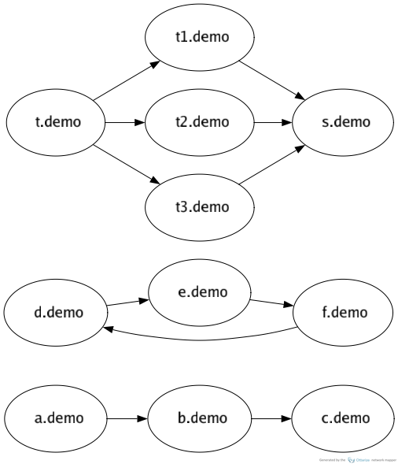

# Service Call Map to Kubernetes YAML Generator

A short script that transforms logical service call maps (e.g., A calls B, B calls C) into Kubernetes deployments. Useful for testing out networking and network policies in Kubernetes.

## Usage

1. **Run the script with a demo file**:
    ```sh
    python gen-graph.py layouts/sample.json
    ```

2. **Apply the generated YAML to your Kubernetes cluster**:
    ```sh
    kubectl apply -f layouts/sample.yaml
    ```

3. **(Optional) Check out the generated call graph using Otterize**:
    ```sh
    otterize mapper visualize -n demo -o out.png; open out.png
    ```

    You can find the installation instructions for the Otterize Network Mapper [here](https://github.com/otterize/network-mapper?tab=readme-ov-file#installation-instructions).

## Example

Given a this file `layouts/sample.json`:

```json
[
    ["demo", "a", "demo", "b"],
    ["demo", "b", "demo", "c"],

    ["demo", "d", "demo", "e"],
    ["demo", "e", "demo", "f"],
    ["demo", "f", "demo", "d"],
    
    ["demo", "t", "demo", "t1"],
    ["demo", "t", "demo", "t2"],
    ["demo", "t", "demo", "t3"],

    ["demo", "t3", "demo", "s"],
    ["demo", "t2", "demo", "s"],
    ["demo", "t1", "demo", "s"]
]
```

The script will generate a corresponding `layouts/sample.yaml` file which you can then `kubectl apply` to your Kubernetes cluster.

Here is an example of the generated call graph:



This image shows the deployments and their interactions as defined in the input file. Each node represents a deployment, and the arrows indicate the calls between them.

It was generating using the [Otterize Network Mapper](https://github.com/otterize/network-mapper) which helps visualizing these relationships, making it easier to understand traffic patterns in Kubernetes clusters and use them to generate network policies using the [Otterize Intents Operator](https://github.com/otterize/intents-operator).

Visit the [docs](https://docs.otterize.com/features/network-mapping-network-policies) to read more.